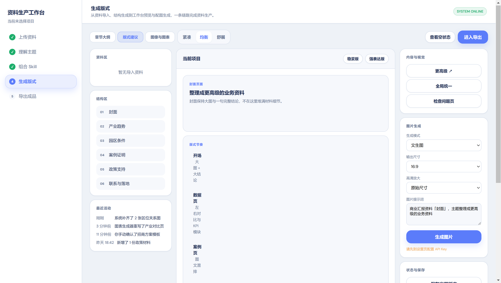

# 资料生产工作台（html-ppt）

一个面向业务团队的 **Electron 桌面版 AI 资料生产工作台**。  
目标不是做一个普通编辑器，而是把“资料导入 → 主题理解 → 结构配置 → 预览生成 → 交付导出”整条链路收进同一个桌面工作台。

## 项目定位

适合这类场景：

- 招商方案
- 汇报材料
- 产品介绍
- 长图 / 信息页

适合这类用户：

- 业务负责人
- 销售 / 方案团队
- 园区招商 / 政企材料团队
- 不熟设计工具、但需要快速产出专业资料的人

## 当前能力

### 1. 资料导入

支持本地资料导入与解析：

- `txt`
- `md`
- `csv`
- `docx`
- `pdf`
- `xlsx`

支持扫描版 PDF 的 OCR 回退。

### 2. 可视化工作流

当前产品流程：

1. 上传资料
2. 理解主题
3. 组合 Skill
4. 生成版式
5. 导出成品

你不需要理解底层模型或 Skill 名称，只需要按交付目标推进流程。

### 3. 模型配置

支持两类模型配置：

- **理解模型**
  - `OpenAI Compatible`
  - `OpenRouter`
- **图片模型**
  - OpenAI-compatible `gpt-image-2`

### 4. OCR 配置

设置页已支持直接配置：

- OCR API URL
- OCR API Key
- OCR Model

并支持重启后持久化。

### 5. 工作台能力

- 成品类型选择
- 推荐配置
- 输出密度切换
- 多种预览模式
- 图片生成入口
- 最近活动 / 状态反馈

### 6. 交付中心

当前导出页已支持：

- 交付状态总览
- 交付前检查
- 最近导出结果
- 项目 JSON 导出
- 协作记录展示

## 运行方式

### 开发环境

```bash
npm install
npm run dev
```

### 生产构建

```bash
npm run build
```

### Windows 目录版打包

```bash
npm run package:dir
```

产物目录：

```text
release/win-unpacked/
```

可执行文件：

```text
release/win-unpacked/资料生产工作台.exe
```

## 测试

### 单元测试

```bash
npm run test
```

### E2E 测试

```bash
npx playwright test
```

当前已覆盖：

- 打包版启动冒烟
- 工作流主路径
- OCR 配置持久化
- 真实 txt 导入
- 项目 JSON 导出

## 截图

### 首页



### 工作台


### 导出页


## 目录结构

```text
src/
  features/
    projects/pages/      # 首页、导入、类型、配置、工作台、导出
    settings/pages/      # 模型与 OCR 设置页
  components/            # 复用组件
  services/              # AI / 文件 / 结构 / 质量服务
  stores/                # Zustand 状态管理

electron/
  ipc/                   # Electron IPC handlers
  services/              # 本地存储、OCR 等 Electron 服务
```

## 当前已验证状态

已验证通过：

- `npm run test`
- `npm run build`
- `npm run package:dir`
- 打包版 Electron 回归测试

## 已知限制

- 当前 **PDF / PPT 真导出能力** 还未真正实现，只完成了交付中心与状态层。
- 当前真正可落盘的交付动作是 **项目 JSON 导出**。
- `release/`、`test-results/` 等构建产物默认不提交。

## 后续方向

优先建议：

1. 真 PDF 导出
2. PPT 可编辑导出
3. 更深的内容理解与结构自动化
4. 更完整的交付与协作流

---

如果你是仓库使用者，建议先从 **打包版目录运行** 开始试用。  
如果你是开发者，建议先执行：

```bash
npm install
npm run test
npm run dev
```
